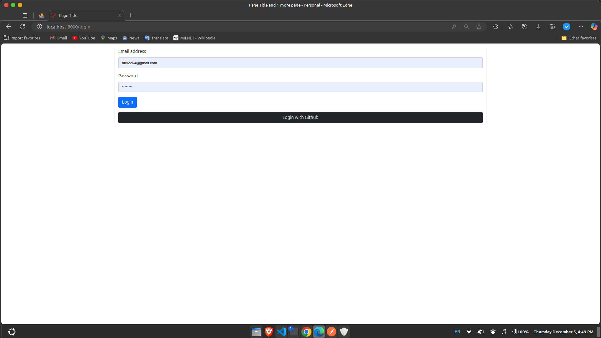

# Laravel GitHub OAuth Authentication

This project implements user authentication using **GitHub OAuth** with **Laravel Socialite**. It allows users to register and log in via their GitHub account, making authentication easy and secure.



## Requirements

- PHP >= 8.1
- Laravel 11.x
- GitHub Developer Account

## Set Up GitHub OAuth

### Step 1: Create OAuth Application on GitHub

1. Go to the [GitHub Developer Portal](https://github.com/settings/developers).
2. Create a new OAuth application by providing the necessary details:
   - **Application Name**
   - **Homepage URL**
   - **Authorization Callback URL**: This should match `http://localhost:8000/auth/github/callback` (for local development).
3. After creating the OAuth app, note down the **Client ID** and **Client Secret**.

### Step 2: Configure `.env` File

In your `.env` file, add the following GitHub OAuth credentials:

```env
GITHUB_CLIENT_ID=your-github-client-id
GITHUB_CLIENT_SECRET=your-github-client-secret
GITHUB_REDIRECT_URI=http://localhost:8000/auth/github/callback
